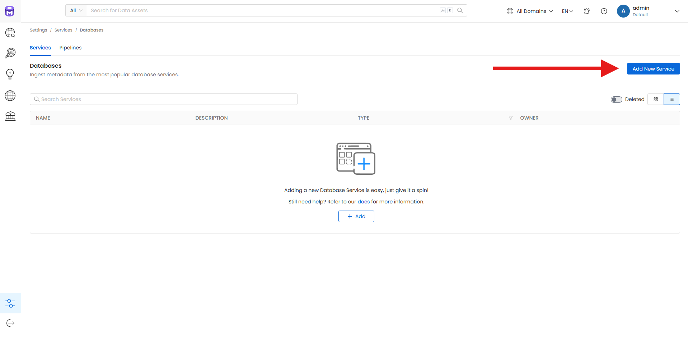
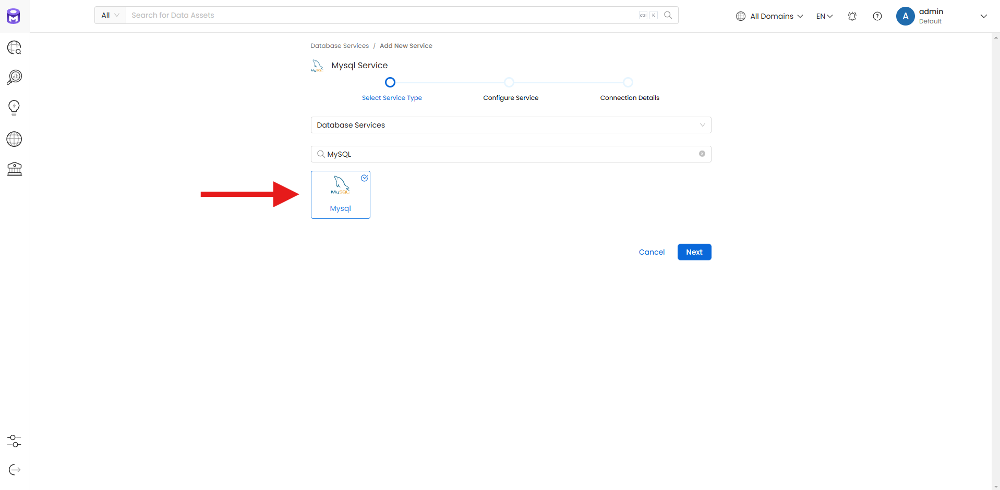
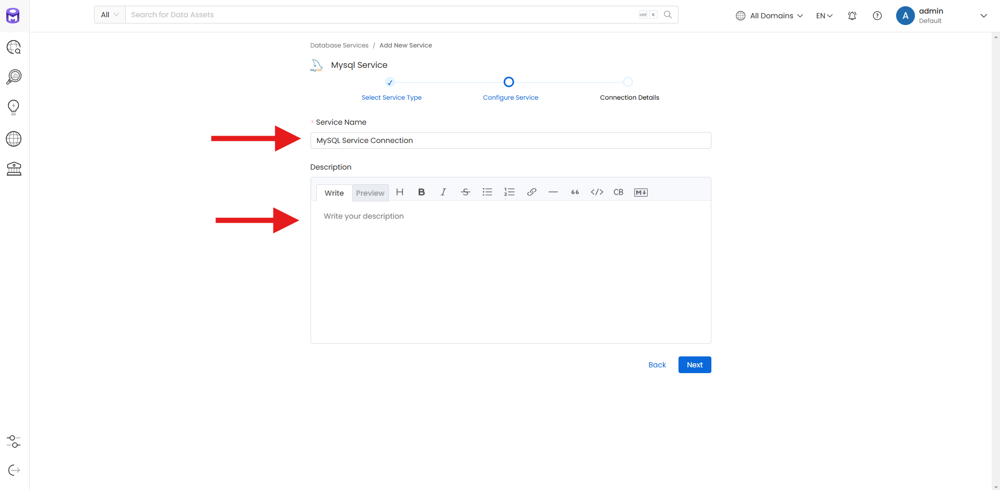
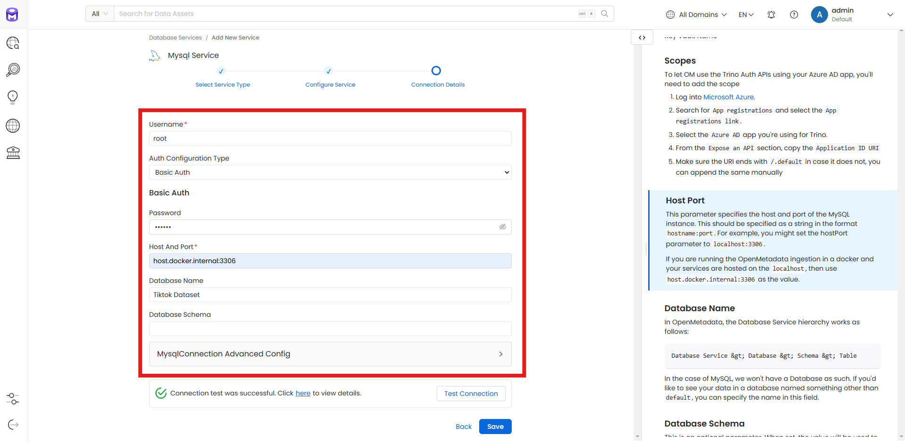
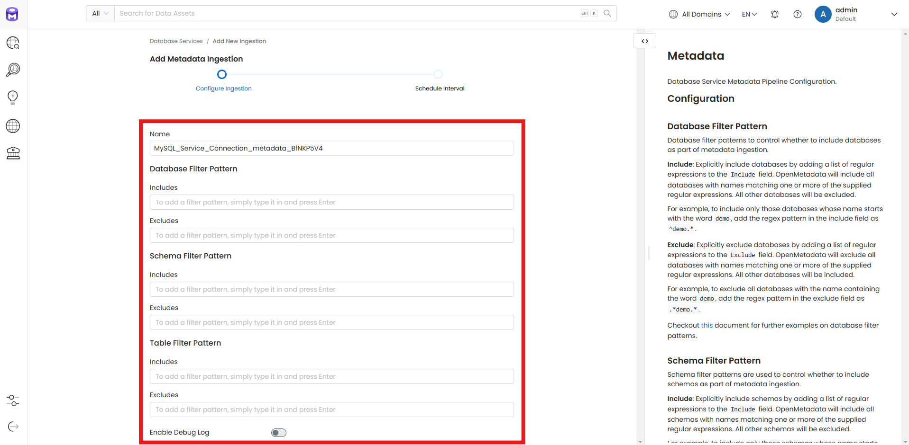
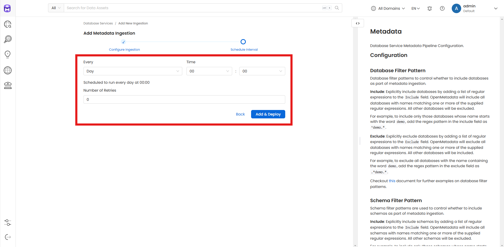
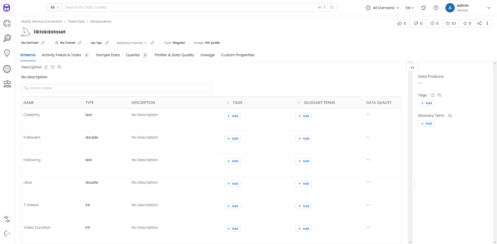
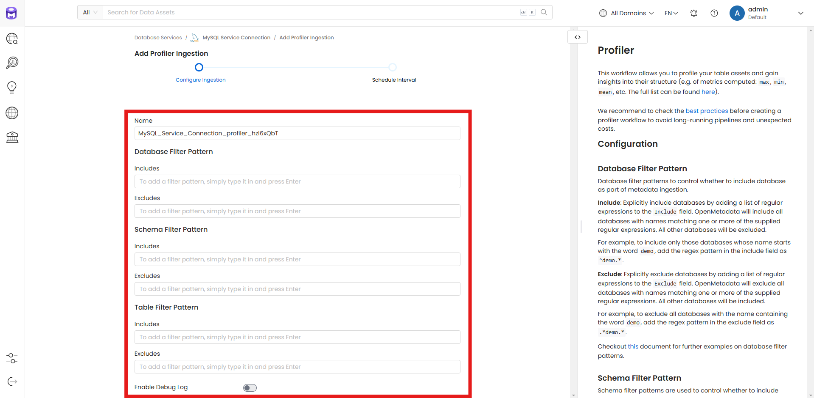

# openmetadata-docker-project

Este projeto é voltado para o estudo de ferramentas de engenharia e orquestração de dados, como [OpenMetadata](https://open-metadata.org/), [Apache Airflow](https://airflow.apache.org/) e [Trino](https://trino.io/) rodando em containers Docker.

O OpenMetadata serve como o núcleo do gerenciamento de metadados, enquanto o Airflow gerencia pipelines de dados e o Trino possibilita consultas distribuídas e de alto desempenho. Este projeto simula um cenário real de ingestão de dados, armazenamento em um banco relacional (MySQL) e execução de queries distribuídas, utilizando containers Docker para garantir portabilidade e reprodutibilidade.

## Estrutura do Projeto

```plaintext
openmetadata-docker-project/
├── data/
│   ├── arquivos.csv        # Arquivos CSV usados para popular o MySQL
├── docker-compose.yml      # Configuração dos containers Docker
└── README.md               # Documentação do projeto
```

## Ingestão de dados no OpenMetadata

Para a ingestão de dados no OM, foram seguidas as seguintes etapas:

### 1. Criar um serviço no OpenMetadata
| Vá em Settings > Services > Databases > Add New Service           
| ---------------------------------- |
|  |

| Selecione o tipo de serviço para a conexão   
| ---------------------------------- |
|  |

| Defina o nome do serviço e a descrição (opcional)
| ---------------------------------- |
|  |

| Defina os detalhes de conexão com o serviço
| ---------------------------------- |
|  |

Coloque as informações corretas para ter uma conexão bem sucedida


### 2. Configure a ingestão de metadados
| Configuração de Ingestão | Intervalo de Ingestão |                           
| ----------------------------------- | ----------------------------------- |
|  |  |

### 3. Visualizando os dados ingestados



### 4. Configurando a profiler ingestion (detalhes sobre uso e qualidade dos dados)
| Configuração de Ingestão | Intervalo de Ingestão |                           
| ----------------------------------- | ----------------------------------- |
|  |  |

Obs: vale lembrar que as configurações e conexões que foram feitas com o banco de dados MySQL rodando localmente na máquina